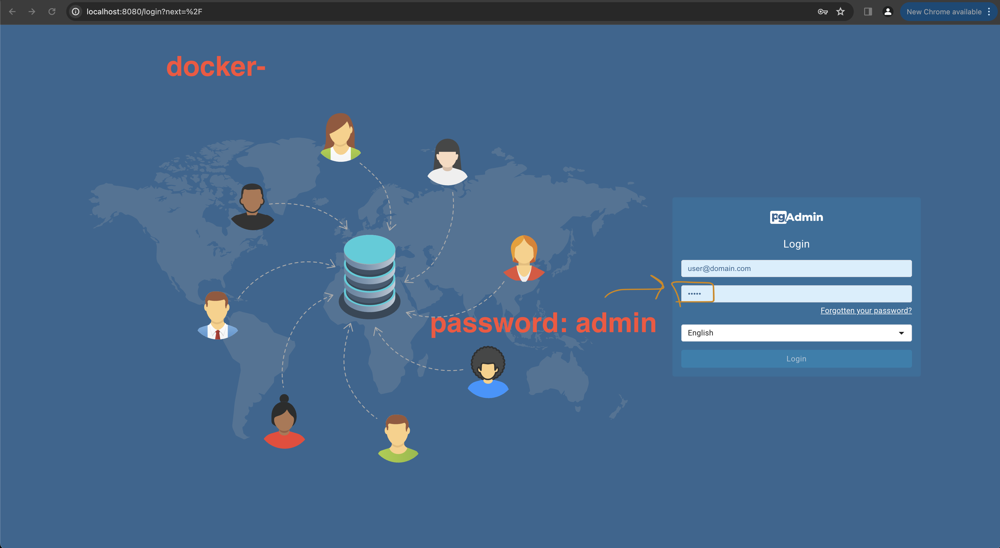
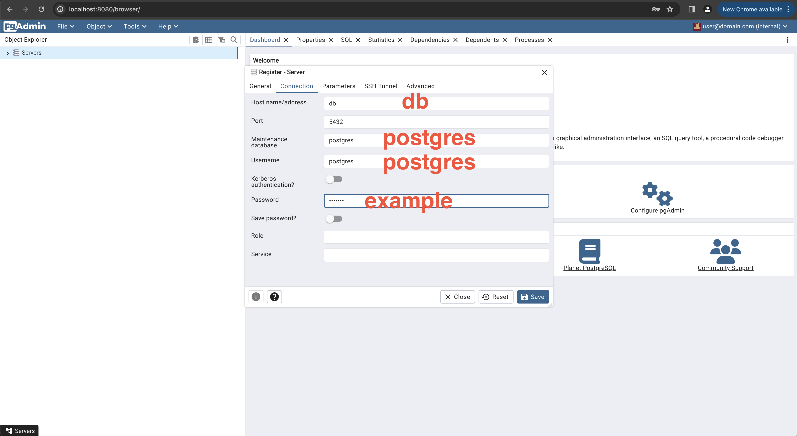

# Description

The authorization-service is a microservice to authorize permissions for the column board and the file-storage. (Other parts will follow).

Internally there is a postgres db which stores, roles, user groups and entities.
They are linked the service returns a list of permissions for a given user groups and entity.

Roles are pre defined.
User groups and entities are required to be set up or managed via an api.

## Installation (Local development)

Install [docker compose](https://docs.docker.com/compose/install/)

```bash
$ npm install
```

## Start the Database

```bash
## start docker containers
$ docker-compose -f ./docker-compose.local.yml up
```

This will start a postgres db and a pgadmin instance.
If there is no data folder, the db will be initialized with the schema in db/seed and a default user `POSTGRES`.

You can access the pgadmin at `http://localhost:8080`.



Add a new server in the UI.
Once connected you have access to the database and can run queries.




## Running the app

```bash
# development
$ npm run start

# watch mode
$ npm run start:dev

# production mode
$ npm run start:prod
```

## Test

```bash
# unit tests
$ npm run test

# e2e tests
$ npm run test:e2e

# test coverage
$ npm run test:cov
```
